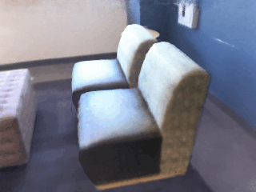
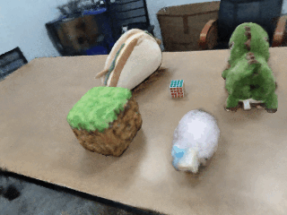

# Learning Object-Compositional Neural Radiance Field for Editable Scene Rendering
### [Project Page](https://zju3dv.github.io/object_nerf) | [Video](https://www.youtube.com/watch?v=VTEROu-Yz04) | [Paper](http://www.cad.zju.edu.cn/home/gfzhang/papers/object_nerf/object_nerf.pdf)

<div align=center>

</div>

> [Learning Object-Compositional Neural Radiance Field for Editable Scene Rendering](http://www.cad.zju.edu.cn/home/gfzhang/papers/object_nerf/object_nerf.pdf)  
> Bangbang Yang, Yinda Zhang, Yinghao Xu, Yijin Li, Han Zhou, Hujun Bao, Guofeng Zhang, Zhaopeng Cui.  
> ICCV 2021


## Installation

We have tested the code on pytorch 1.8.1, while a newer version of pytorch should also work.

```bash
conda create -n object_nerf python=3.8
conda activate object_nerf
conda install pytorch==1.8.1 torchvision cudatoolkit=11.1 -c pytorch -c conda-forge
pip install -r requirements.txt
```

## Data Preparation

Please go to the [data preparation][1].

## Training

You can run `train.py` to train the model, and here are two examples.

```bash
# train on ScanNet 0113
python train.py dataset_config=config/scannet_base_0113_multi.yml "img_wh=[640,480]" exp_name=my_expr_scannet_0113

# train on ToyDesk 2
python train.py dataset_config=config/toy_desk_2.yml "img_wh=[640,480]" exp_name=my_expr_toydesk_2
```

## Editable Scene Rendering

Here we provide two examples of scene editing with pre-trained models ([download link](https://zjueducn-my.sharepoint.com/:u:/g/personal/ybbbbt_zju_edu_cn/EXHxpYHvEKNGgvCmMqT3Gk8BN80uEFSyqwq0R84d_cnH1Q?e=oipDsn)).

### ScanNet Object Duplicating and Moving

```bash
python test/demo_editable_render.py \
    config=test/config/edit_scannet_0113.yaml \
    ckpt_path=../object_nerf_edit_demo_models/scannet_0113/last.ckpt \
    prefix=scannet_0113_duplicating_moving
```

### ToyDesk Object Rotating

```bash
python test/demo_editable_render.py \
    config=test/config/edit_toy_desk_2.yaml \
    ckpt_path=../object_nerf_edit_demo_models/toydesk_2/last.ckpt \
    prefix=toy_desk2_rotating
```

Remember to change the `ckpt_path` to the uncompressed model checkpoint file.

You can find the rendered image in `debug/rendered_view/render_xxxxxx_scannet_0113_duplicating_moving` or `debug/rendered_view/render_xxxxxx_toy_desk2_rotating` which should look as follows:

<div align=center>

&nbsp&nbsp&nbsp&nbsp

</div>

<!-- <div align=center>

</div> -->

## Citation

If you find this work useful, please consider citing:

```
@inproceedings{yang2021objectnerf,
    title={Learning Object-Compositional Neural Radiance Field for Editable Scene Rendering},
    author={Yang, Bangbang and Zhang, Yinda and Xu, Yinghao and Li, Yijin and Zhou, Han and Bao, Hujun and Zhang, Guofeng and Cui, Zhaopeng},
    booktitle = {International Conference on Computer Vision ({ICCV})},
    month = {October},
    year = {2021},
}
```


## Acknowledgement

In this project we use (parts of) the implementations of the following works:

- [nerf_pl](https://github.com/kwea123/nerf_pl/) by kwea123.
- [nerf_pytorch](https://github.com/yenchenlin/nerf-pytorch) by Yen-Chen Lin.
- [scannet](https://github.com/ScanNet/ScanNet) by Angela Dai.

We thank the respective authors for open sourcing their methods. 

[1]: ./data_preparation/